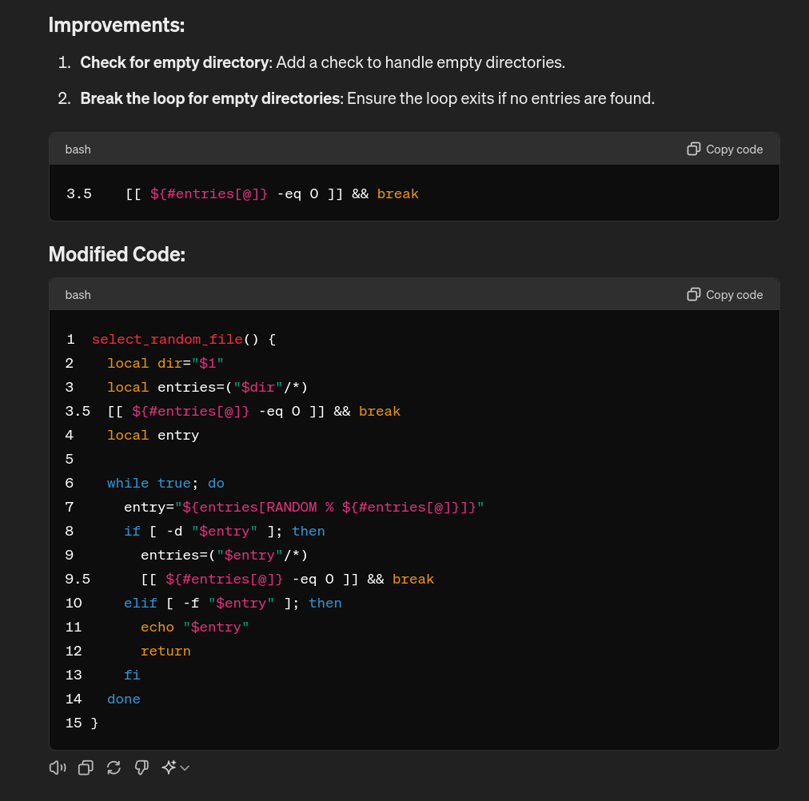
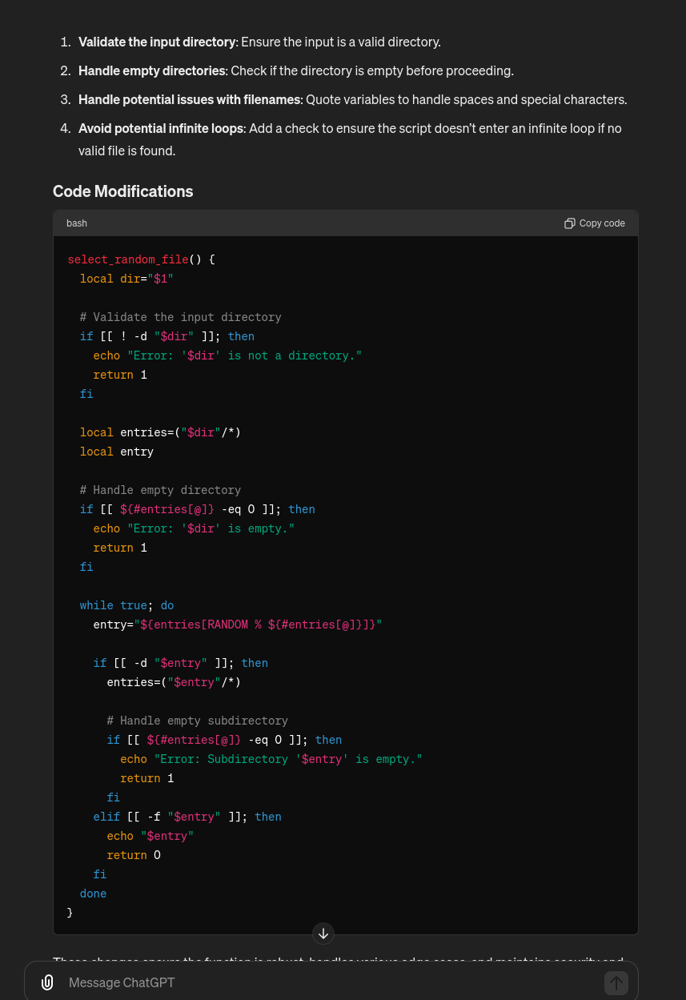

# Proompty

A dumb assistant for organized Proompt inge-near

Proompty is a command line tool to generate prompt based of template you manage.

Why ? Meeeh, creating prompt sucks, you type and type to "maybe" have a decent result...

And once you have good prompts... how do you manage them ? a single file ? an Obsidian directory perhaps ? Copy pasting ? Maaan this sucks too !

Weren't AI suppose to fix this stupid grind ? ...

Follow me in going full circle, use a CLI tool to generate your prompts, manage prompt templates and prompt mods, no need for AI when you have autocomplete in your terminal !!

## TL;DR

```bash
# install
curl -s https://raw.githubusercontent.com/DimitriGilbert/Proompty/main/utils/get_Proompty -O;
chmod +x get_Proompty;
./get_Proompty --install;

# generate a proompt
Proompty get <my/proompt/template/path>
  [--prefix-mod|-p <my/proompt/mod/path>]
  [--suffix-mod|-s <my/proompt/mod/path>]
  [--<var name> <var value>] ...
  [--template-file <my/proompt/template/path>]

# add a proompt
Proompty add <my/proompt/template/name>
  [--template-file <my/proompt/template/path>]
  [--description <my description>]
  [--tags <tag1>] [--tags <tag2>]
  [--template-content <my template content>]
  [--set-var <var name> --set-var-value <var value>] ...
```
## Demonstration

The following commands have been used to generate the proompts below

### 1

```bash
Proompty get intro/snippet \
  --suffix concise/short \
  --suffix dev/code/add-line-number \
  --suffix dev/concise/just-diff \
  --suffix ready/help \
  --task "improve code quality" \
  --snippet 'select_random_file() {
  local dir="$1"
  local entries=("$dir"/*)
  local entry

  while true; do
    entry="${entries[RANDOM % ${#entries[@]}]}"
    if [ -d "$entry" ]; then
      entries=("$entry"/*)
    elif [ -f "$entry" ]; then
      echo "$entry"
      return
    fi
  done
}'
```
outputs : 
```
I need some help with this code snippet
select_random_file() {
  local dir="$1"
  local entries=("$dir"/*)
  local entry

  while true; do
    entry="${entries[RANDOM % ${#entries[@]}]}"
    if [ -d "$entry" ]; then
      entries=("$entry"/*)
    elif [ -f "$entry" ]; then
      echo "$entry"
      return
    fi
  done
}
Could you help me improve code quality ?
keep your responses short please.
please add the line numbers in the code output.
No need to give me the full code, I just want the modifications.
Are you ready to help me ?
```
what chatGPT told me :


### 2

```bash
Proompty get intro/snippet \
  --suffix concise
  --suffix dev/code/add-line-number \
  --suffix dev/concise/just-diff \
  --task "improve code quality" \
  --snippet 'select_random_file() {
  local dir="$1"
  local entries=("$dir"/*)
  local entry

  while true; do
    entry="${entries[RANDOM % ${#entries[@]}]}"
    if [ -d "$entry" ]; then
      entries=("$entry"/*)
    elif [ -f "$entry" ]; then
      echo "$entry"
      return
    fi
  done
}' \
  --suffix dev/code/security
  --suffix dev/praise
```
outputs :
```
I need some help with this code snippet
select_random_file() {
  local dir="$1"
  local entries=("$dir"/*)
  local entry

  while true; do
    entry="${entries[RANDOM % ${#entries[@]}]}"
    if [ -d "$entry" ]; then
      entries=("$entry"/*)
    elif [ -f "$entry" ]; then
      echo "$entry"
      return
    fi
  done
}
Could you help me improve code quality ?
It is very important that you keep the output quantity as low as possible.
Include only necessary information.
I will ask if I need more.
No need to give me the full code, I just want the modifications.
our software security is extremely important ! 
the highest security standards are required from you !
You are a great developer !
```
what chatGPT told me :
 

## Installation

An installation script is provided

```bash
# download the script
curl -s https://raw.githubusercontent.com/DimitriGilbert/Proompty/main/utils/get_Proompty -O;
# make it executable
chmod +x get_Proompty;
# display the help
./get_Proompty --help;
#	-b, --branch|--tag|--install-version <branch>: version to install
#	--install-directory <install-directory>: where to install
#	--install-file <install-file>: rc files to install to, forces install, repeatable
#	-i|--install|--no-install: install in bashrc
#	--remove-installer|--no-remove-installer: remove install script itself
#	aliases: --rm,
#	--ssh|--no-ssh: clone using ssh
#	--zip|--no-zip: install using zip archive, not recommended

# generic install
./get_Proompty --install;
```